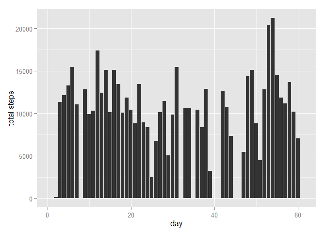
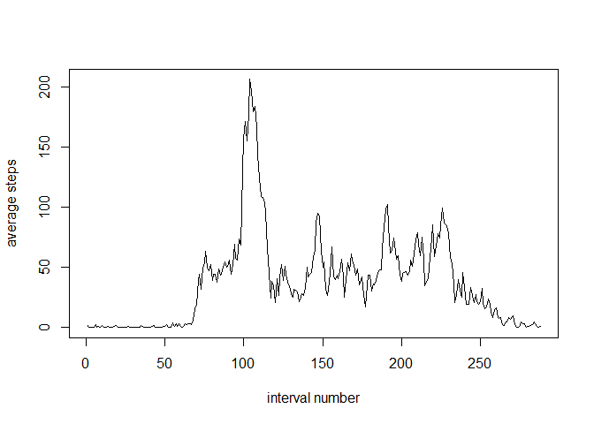
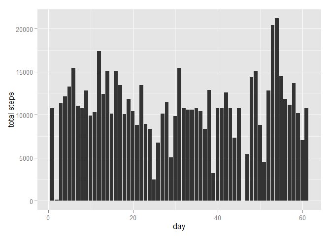
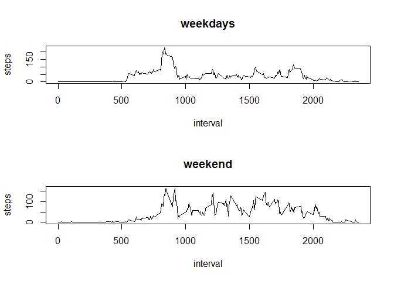

# Reproducible Research: Peer Assessment 1

```r
library(ggplot2)
```

## Loading and preprocessing the data

### 1. Load the data.
Zip has been unzipped before.

```r
activity <- read.csv(".\\activity.csv")
```

### 2. Process/transform the data (if necessary) into a format suitable for your analysis.

No steps performed.

## What is mean total number of steps taken per day?

### 1. Calculate the total number of steps taken per day.

```r
steps_per_day <- data.frame(tapply(activity$steps, activity$date, sum, na.rm = TRUE))
steps_per_day <- cbind(steps_per_day, 1:61)
colnames(steps_per_day) <- c("steps", "day")
```

### 2. Make a histogram of the total number of steps taken each day


```r
qplot(x = steps_per_day$day, y =steps_per_day$steps, stat="identity", geom = "histogram", binwidth = 1000, xlab = "day", ylab = "total steps")
```

 

### 3. Calculate and report the mean and median of the total number of steps taken per day.

```r
mean(steps_per_day$steps)
```

```
## [1] 9354.23
```

```r
median(steps_per_day$steps)
```

```
## [1] 10395
```

## What is the average daily activity pattern?

### 1. Make a time series plot


```r
average_steps_per_interval <- tapply(activity$steps, activity$interval, mean, na.rm = TRUE)
```


```r
plot(average_steps_per_interval, type = 'l', xlab = "interval number", ylab = "average steps")
```

 

### 2. Which 5-minute interval, on average across all the days in the dataset, contains the maximum number of steps?


```r
rownames(data.frame(average_steps_per_interval[which.max(average_steps_per_interval)]))
```

```
## [1] "835"
```

## Imputing missing values

### 1. Calculate and report the total number of missing values in the dataset.


```r
data.frame(table(is.na(activity$steps)))[2, 2]
```

```
## [1] 2304
```

### 2. Devise a strategy for filling in all of the missing values in the dataset.

Take the mean for a interval for missing values.

```r
average_steps_per_interval <- data.frame(average_steps_per_interval)
filler <- function(steps, interval) {
  if (!is.na(steps))
    return(steps)
  else
    return(average_steps_per_interval[which(rownames(average_steps_per_interval) == interval), "average_steps_per_interval"])
}
```

### 3. Create a new dataset that is equal to the original dataset but with the missing data filled in.


```r
activity_filled <- activity
activity_filled$steps <- mapply(filler, activity_filled$steps, activity_filled$interval)
```

### 4. Make a histogram of the total number of steps taken each day and Calculate and report the mean and median total number of steps taken per day.


```r
steps_per_day_filled <- data.frame(tapply(activity_filled$steps, activity_filled$date, sum, na.rm = TRUE))
steps_per_day_filled <- cbind(steps_per_day_filled, 1:61)
colnames(steps_per_day_filled) <- c("steps", "day")
```


```r
qplot(x = steps_per_day_filled$day, y =steps_per_day_filled$steps, stat="identity", geom = "histogram", binwidth = 1000, xlab = "day", ylab = "total steps")
```

 


```r
mean(steps_per_day_filled$steps)
```

```
## [1] 10766.19
```

```r
median(steps_per_day_filled$steps)
```

```
## [1] 10766.19
```
Do these values differ from the estimates from the first part of the assignment? -> Yes

What is the impact of imputing missing data on the estimates of the total daily number of steps? -> The daily number of steps increased by imputing missing data.

## Are there differences in activity patterns between weekdays and weekends?

### 1. Create a new factor variable in the dataset with two levels- "weekday" and "weekend" indicating whether a given date is a weekday or weekend day.


```r
eval_day <- function(date) {
  day <- weekdays(as.Date(date))
  if (day %in% c("Monday", "Tuesday", "Wednesday", "Thursday", "Friday"))
    return("weekday")
  else if (day %in% c("Saturday", "Sunday"))
    return("weekend")
}
```


```r
Sys.setlocale("LC_TIME","English")
```

```
## [1] "English_United States.1252"
```

```r
activity_filled$day_type <- sapply(activity_filled$date, eval_day)
```


```r
averages <- aggregate(steps ~ interval + day_type, activity_filled, mean)
weekdays <- subset(averages, day_type == "weekday")
weekend <- subset(averages, day_type == "weekend")
```

### 2. Make a panel plot containing a time series plot (i.e. type = "l") of the 5-minute interval (x-axis) and the average number of steps taken, averaged across all weekday days or weekend days (y-axis).


```r
par (mfrow = c(2, 1))
plot(weekdays$interval, weekdays$steps, type = 'l', xlab = "interval", ylab = "steps", main = "weekdays")
plot(weekend$interval, weekend$steps, type = 'l', xlab = "interval", ylab = "steps", main = "weekend")
```

 
